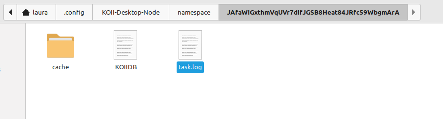
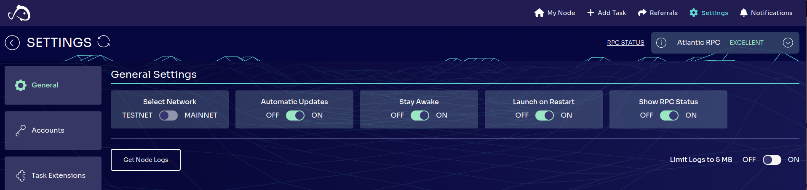
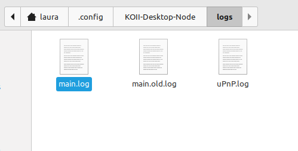

# Lesson 1: Introduction to Koii Tasks

> [!TIP]
>
> Want to skip the explanations and get started quickly?
>
> [Get a task up and running in 2 minutes](../Get%20Started%20-%20Quick%20Intro/README.md).

## Part 1: Running an Existing Task

Welcome to Koii! We're building an open decentralized computing network, and this is your guide for building tasks to run on the network.

### Why Koii?

- The 1st Layer 1 dedicated to merging AI and DePIN ecosystem development.
- Intuitive tools for building DePIN apps (AI inference, bandwidth, data scraping, etc).
- Tens of thousands of compute devices and best-in-class unit economics.
- A robust Web3 infra for projects.
- Supports existing altcoins and stablecoins, in addition to $KOII.

### What is a Koii Task?

A Koii Task is a decentralized computing job that runs across our network of nodes. We'll get into exactly how it works shortly, but for now let's run one and see it in action.

Tasks run on Koii nodes, so the first thing we're going to do is set up a node.

### Install the Node

To get started, you'll need to download and install the [Desktop Node](https://www.koii.network/node). Complete instruction are available [here](https://docs.koii.network/run-a-node/task-nodes/how-to-run-a-koii-node). As part of this process, a KOII wallet will be created for you. You can find the public key for your Node wallet on the sidebar or under Settings/Accounts:


> [!TIP]
>
> Our docs have more information on [wallets and public keys](https://docs.koii.network/run-a-node/task-nodes/concepts/tokens-and-wallets).

### Get Some Tokens

In order to run a task, you'll need to have a few tokens for staking. During the node setup process, you were directed to the [faucet](https://faucet.koii.network/) to get some free tokens, so you should be all set!

> [!TIP]
>
> **Why do you need tokens to run a task?**
>
> Every task requires a stake in tokens. Staking keeps your tasks safe from bad actors: if a task runner acts maliciously, they will be penalized and lose some or all of this stake.

### Run the Task

If you'd like to earn some extra KOII, you can run any of the tasks from the `Add Task` list in your node.


However, we want to run the EZ Testing task. It is not a public task, so it needs to be added manually. In the `Add Task` tab, click on the "Advanced" link at the bottom left. Paste in the EZ Testing Task ID (`AK2P1L8NWGwWarbHeM7tX2mr4hJA7ZVXGSSSz5PWHBHv`) and set your stake to 1.9 KOII. Wait for the metadata to download and then start the task. Move to the `My Node` tab and you should see the task running.


> [!TIP]
>
> **What is a Task ID?**
>
> Tasks are deployed to the Koii blockchain. In order to connect to the task on the blockchain, we use a unique identifier for each task, called a Task ID. In a later lesson we'll cover deployment and how to get your own Task ID.

To get a better idea of what the task is doing, we're going to take a look at the log files. This is optional, feel free to skip to the [next step](./PartIII.md) if you'd rather get straight to working with the code.

### View the Task Log

To view the log for a specific task, click any of the tasks in your Node and select 'Output Logs' as shown below:


This will open a folder containing the `task.log` file:



### View the Main Log

In addition to task-specific logs, there's a main log for information about the node. You can access it from the Settings menu:





### Real-time Log Updates

#### MacOS and Linux

Try navigating to the logs directory in your terminal:

```sh
# MacOS
cd /Users/<username>/Library/Application Support/KOII-Desktop-Node/logs/
```

```sh
# Linux
cd /home/<username>/.config/KOII-Desktop-Node/logs/
```

You can then run the following command to watch your logs in real time:

```sh
tail -f main.log
```

#### Windows

In Windows, there is no `tail` command, but you can run the following command in PowerShell:

```sh
Get-Content -Path "/Users/<username>/AppData/Roaming/KOII-Desktop-Node/logs/main.log" -Wait
```

Congratulations! Now that you've set up a node and run your first task, let's try some debugging. [Part II](./PartII.md)
