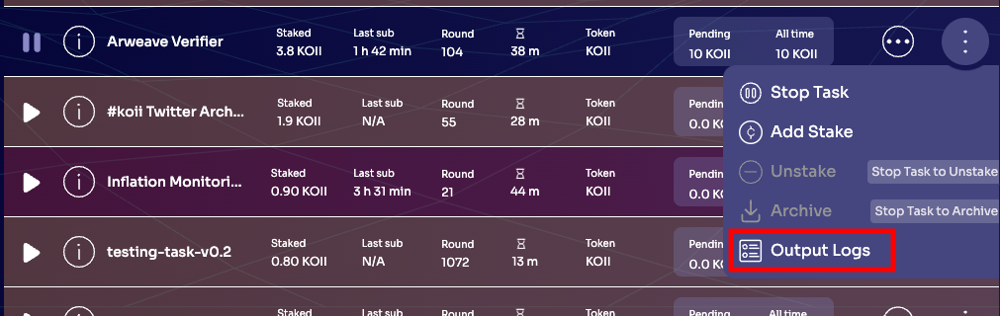

# Lesson 1: Introduction to Koii Tasks

## Part II: Node and Logs

### Prerequisite
1. You are runing a [node](https://docs.koii.network/run-a-node/task-nodes/how-to-run-a-koii-node).
2. Create your own wallet by downloading the node and earn tokens through [Faucet](https://docs.koii.network/run-a-node/task-nodes/time-to-node) and through running tasks. 
3. You have ran at least a task. 

### The Node Application Folder

To see where the node keeps logs about a specific task, click any of the tasks in your Node and select 'View Logs' as shown below:

The key here is that each 'namespace' contains one Task, and all requisite logs, databases, and other information are stored here. Tasks cannot access anything outside of their own namespace, so master logs are kept at the node level as well (`<OS-specific path>/KOII-Desktop-Node/logs/main.log`).

### Logs

Before you learn how to develop your own tasks, it's very important to know how to **debug** them.

Try running `tail -f main.log` and then clicking some buttons in the node (i.e. Play and Pause Tasks). You'll immediately see the logs update in real time.

**NOTE:** Make sure your terminal is in the [`logs`](#the-node-application-folder) directory!

Next, let's run your first task! [Part III: Running a Task](./PartIII.md)
