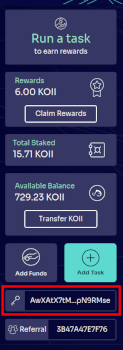
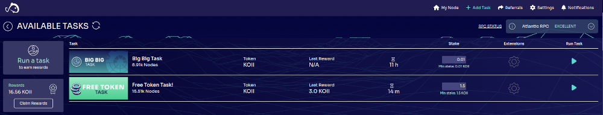
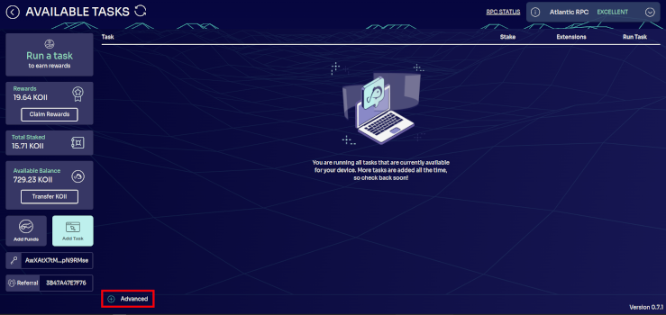

# Lesson 1: Introduction to Koii Tasks

## Part II: Node and Logs

### Prerequisites

- You understand [task runtime flow](./README.md)

### Install the Node

To get started, you'll need to download and install the [Desktop Node](https://www.koii.network/node). Complete instruction are available [here](https://docs.koii.network/run-a-node/task-nodes/how-to-run-a-koii-node). As part of this process, a KOII wallet will be created for you. You can find the public key for your Node wallet on the sidebar or under Settings/Accounts:

### Get Some Tokens

In order to run a task, you'll need to have a few tokens for staking. You can get some tokens for free from the [faucet](https://faucet.koii.network/). To use the faucet, you will need to [install Finnie](https://docs.koii.network/concepts/finnie-wallet/introduction).

### Run a Task

If you'd like to earn some extra KOII, you can run any of the tasks from the `Add Task` list in your node.

However, we want to run the EZ Testing task. It is not a public task, so it needs to be added manually. In the `Add Task` tab, click on the "Advanced" link at the bottom left. Paste in the EZ Testing Task ID (`AK2P1L8NWGwWarbHeM7tX2mr4hJA7ZVXGSSSz5PWHBHv`) and set your stake to 1.9 KOII. Wait for the metadata to download and then start the task. Move to the `My Node` tab and you should see the task running.

### The Node Application Folder

To see where the node keeps logs about a specific task, click any of the tasks in your Node and select 'Output Logs' as shown below:

### Logs Location

Logs for individual tasks are located at `<OS-specific path>/KOII-Desktop-Node/namespace/<taskID>/task.log`. The key here is that each 'namespace' contains one Task, and all requisite logs, databases, and other information are stored here. Tasks cannot access anything outside of their own namespace, so master logs are kept at the node level as well (`<OS-specific path>/KOII-Desktop-Node/logs/main.log`).

The OS-specific paths are as follows:

**Windows**: `/Users/<username>/AppData/Roaming`

**Mac**: `/Users/<username>/Library/Application Support`

**Linux**: `/home/<username>/.config`

### Logs

Before you learn how to develop your own tasks, it's very important to know how to **debug** them.

Try running `tail -f main.log` and then starting and stopping a task. You'll immediately see the logs update in real time.

**NOTE:** Make sure your terminal is in the [`logs`](#the-node-application-folder) directory!

Next, let's run your first task! [Part III: Running a Task](./PartIII.md)
