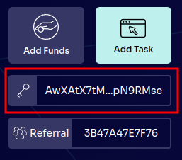
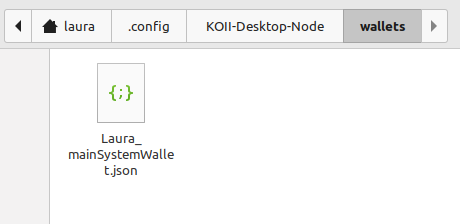

# Lesson 1: Introduction to Koii Tasks

## Part IV: Deploying a Task

> [!WARNING]
>
> In order to deploy a task you must download the desktop node and **run at least one task**. This will make a staking wallet that is usable for IPFS, which is required during deployment. If you have followed the EZSandbox tutorial up to this point, you already have a staking wallet.
>

### Environment Variables

Before we deploy a task, let's take a quick look at how to add environment variables to your task. These are called "Task Extensions" in the node, and they allow you to ask each node operator for customized data needed for the task - for example, Twitter login credentials for a task that's accessing Twitter.
<!-- Comment - was typo task-config.yml changed it to config-task.yml -->
To get a variable in your task, add it to your `config-task.yml`, in the `requirementsTags` section:

```yml
requirementsTags:
- type: TASK_VARIABLE
  value: 'VARIABLE_NAME'
  description: 'Variable description'
```

The value and description will be shown in the desktop node, so make them descriptive enough that users will understand what to enter:


Then you can use them in your task like any other Node.js environment variable, with `process.env.VARIABLE_NAME`. (While testing locally, you should define these in your .env).

> [!IMPORTANT]
>
> In order to add new environment variables to a task so they can be configured in the desktop node, you must deploy or update it. This is because the task metadata is set at the time of deployment and can only be changed by updating the task. However, if you would like to test locally first, you can add the variables to your .env and run prod-debug.

### Deploying a Task

> [!WARNING]
>
> In order to deploy a task, you **MUST** be using at least Node.js v18. 
To check the version run: 
```node --version```

<!-- Comment - Need instructions how to check version, how to fix if wrong version. -->


#### Building

The first step before deployment is to build your executable. First, makes sure you have installed all the necessary dependencies using

```sh
yarn
```

Then run

```sh
yarn webpack
```

in order to create the executable.

#### Install Koii CLI Suite

<!-- Comment : does this work by default on windows or do you need to install curl? Doesn't seem to work on linux? Need to verify works on linux, window and mac 
This one appears to be windows command.
-->

```sh
cmd /c "curl -L https://github.com/koii-network/k2-release/releases/download/v1.16.2/koii-install-init-x86_64-pc-windows-msvc.exe --output C:\koii-install-tmp\koii-install-init.exe --create-dirs"
```

#### Get Wallet

There are two ways to get a wallet for deploying your tasks. The simplest method is to use your wallet from the desktop node, which is what we'll do here. You also have the option to [create a new wallet using the CLI](https://docs.koii.network/develop/command-line-tool/koii-cli/create-wallet), if you prefer.

#### Fund Your Wallet

If you're attending a live event, you will receive tokens to pay the deployment fees. If you're not attending a live event, you can earn tokens by running tasks in the desktop node.

To request tokens, you'll need to provide your wallet's public key. You can find that in the desktop node:



#### Create Task CLI

Now it's time to deploy our executable. For this you'll need to run

```sh
npx @_koii/create-task-cli@latest
```

which will show you the following menu:

```sh
? Select operation › - Use arrow-keys. Return to submit.
❯   Create a New Local Repository
    Deploy a New Task
    Update Existing Task
    Activate/Deactivate Task
    Claim Reward
    Fund Task with More KOII
    Withdraw Staked Funds from Task
    Upload Assets to IPFS (Metadata/Local Vars)
```

Choose `Deploy a New Task`. Next, you may be asked if you want to use your Koii CLI wallet:

```sh
It looks like you have a koii cli installed. Would you like to use your koii cli key (/home/laura/.config/koii/id.json) to deploy this task? › (y/N)
```

If you're not using a Koii CLI wallet, be sure to choose `no` at this point. Next you may be asked a similar question about your desktop node wallet:

```sh
It looks like you have a desktop node installed. Would you like to use your desktop node key (/home/laura/.config/KOII-Desktop-Node/wallets/Laura_mainSystemWallet.json) to deploy this task? › (y/N)
```

In most cases, you should choose `yes` at this point. If you choose `no` for this as well, or if the CLI can't automatically detect the location of your wallet, you will be asked to manually enter the path to your wallet:

```sh
? Enter the path to your wallet ›
```

In the case of your desktop node wallet, it should be located at `<OS-specific path>/KOII-Desktop-Node/wallets/<name>_mainSystemWallet.json`.

The OS-specific paths are as follows:

**Windows**: `/Users/<username>/AppData/Roaming`

**Mac**: `/Users/<username>/Library/Application Support`

**Linux**: `/home/<username>/.config` (This path contains a dot folder that may be hidden by default. You can show hidden folders by pressing Ctrl-H)

In the example below, the wallet is located at `home/laura/.config/KOII-Desktop-Node/wallets/Laura_mainSystemWallet.json`



After you've entered the path to your wallet, you'll be asked how you want to configure your task:

```sh
? Select operation › - Use arrow-keys. Return to submit.
❯   using CLI
    using config YML
```

Choose "Using config YML".

#### Staking Wallet

> [!NOTE]
>
> **Why do I need two wallets? What's the difference?**
>
> The wallet you use for deploying your task is the one that needs to be funded, as it will be used for paying deployment fees. However, your task executable must be uploaded to IPFS so it can be distributed to the desktop nodes. In order to ensure the security of uploads, all file uploads must be signed. This signing process requires the use of a wallet called a Staking Wallet, which has a special role in running Koii tasks. This special role allows it to be used for signing uploads. This wallet does not need to have a balance.

Next, you'll be asked how you would like to upload your metadata:

```sh
? Select operation › - Use arrow-keys. Return to submit.
❯   Using KOII Storage SDK
    Manually Input IPFS
```

Choose `Using KOII Storage SDK`.

```sh
? It looks like you have a desktop node installed. Would you like to use your desktop node staking key (/home/laura/.config/KOII-Desktop-Node/namespace/Laura_stakingWallet.json) to sign this upload to IPFS? › (y/N)
```

If you choose no, or if your staking wallet's location cannot be found automatically, you will be asked to manually enter the path:

```sh
? Enter the path to your staking wallet ›
```

When you installed the desktop node, a staking wallet was created for you automatically. This can be found in `<OS-specific path>/KOII-Desktop-Node/namespace/<name>_stakingWallet.json`.

> [!IMPORTANT]
>
> In order for your staking wallet to be usable by the CLI, you must run at least one task in the desktop node.

#### Choose Task Type

You'll now be asked what type of task you want to deploy:

```sh
? Select operation › - Use arrow-keys. Return to submit.
❯   KOII-Task
    KPL-Task
```

Here, we'll deploy a Koii Task but if you'd like to deploy a task using your own token, you must have a [previously minted KPL token](../Lesson%206/PartI.md).


#### Confirm

You will be then be prompted to confirm that you want to pay the rent and bounty, type 'y' to confirm:

```sh
Your account will be deducted XX KOII for creating the task, which includes the rent exemption(XX KOII) and bounty amount fees (XX KOII) › (y/N)
```

<!-- Comment - Should have a what do I do if I don't have enough Koii -->

> [!NOTE]
>
> If you are using the default values in config-task.yml and deploying a Koii Task, your total deployment fee should be about 17 KOII, which is the minimum possible amount.

Your task should now be deployed successfully and you should see a response similar to this:

```sh
Calling Create Task
Task Id: 9oDEkeHwyGJVect8iEF1hHPKYdkqbtRToarbi8KQtgNS
Stake Pot Account Pubkey: stakepotaccountp39zkKbCKoiLp3wZ66TuUu5LtS9d
Note: Task Id is basically the public key of taskStateInfoKeypair.json
Success
```

> [!IMPORTANT]
>
> Make sure you save your task ID every time you deploy or update! Not only do you need it to run your task in the desktop node, it's required when updating your task.

Congratulations, you've deployed a task!

In this lesson, you've learned how to run, debug, and deploy a task. Now let's get into the specifics of writing a task. [Lesson 2](../Lesson%202/README.md)
