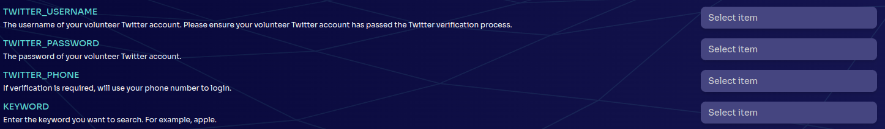
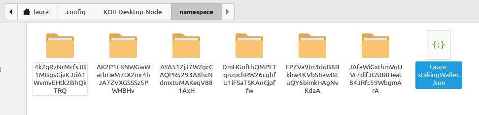

# Lesson 1: Introduction to Koii Tasks

## Part IV: Deploying a Task

> [!WARNING]
>
> In order to deploy a task you must download the desktop node and stake on at least one task. This will create your staking wallet, which is required during deployment. If you have followed the EZSandbox tutorial up to this point, you already have a staking wallet.
>

### Environment Variables

Before we deploy a task, let's take a quick look at how to add environment variables to your task. These are called "Task Extensions" in the node, and they allow you to ask each node operator for customized data needed for the task - for example, Twitter login credentials for a task that's accessing Twitter.

To get a variable in your task, add it to your `task-config.yml`, in the `requirementsTags` section:

```yml
requirementsTags:
- type: TASK_VARIABLE
  value: 'VARIABLE_NAME'
  description: 'Variable description'
```

The value and description will be shown in the desktop node, so make them descriptive enough that users will understand what to enter:



Then you can use them in your task like any other Node.js environment variable, with `process.env.VARIABLE_NAME`. (While testing locally, you should define these in your .env).

### Deploying a Task

#### Building

The first step before deployment is to build your executable. First, makes sure you have installed all the necessary dependencies using

```sh
npm install
```

Then run

```sh
npm run webpack
```

in order to create the executable.

#### Install Koii CLI Suite

```sh
cmd /c "curl -L https://github.com/koii-network/k2-release/releases/download/v1.16.2/koii-install-init-x86_64-pc-windows-msvc.exe --output C:\koii-install-tmp\koii-install-init.exe --create-dirs"
```

#### Create Wallet

```sh
koii-keygen new -o ~/.config/koii/id.json
```

> [!WARNING]
>
> This is an unencrypted keypair. Do not share this file with anyone.
>

When creating your wallet, you will be prompted for a BIP39 passphrase. This is optional, but adds additional security to your seed phrase. It does not affect the security of the underlying wallet.

After creating your wallet, you'll be given a pubkey (wallet address) and a seed phrase for recovery - note these down. You can share your pubkey freely; keep your seed phrase a secret and store it somewhere secure.

#### Get Tokens

If you're attending a live event, you will receive tokens to pay the deployment fees. If you're not attending a live event, you can earn tokens by running tasks in the desktop node.

To transfer tokens into your wallet, you will need your wallet's pubkey. If you ever forget it, you can find it by running:

```sh
koii address
```

#### Deploying

Now it's time to deploy our executable. For this you'll need to run

```sh
npx @_koii/create-task-cli@latest
```

which will show you the following menu:

```sh
? Select operation › - Use arrow-keys. Return to submit.
❯   Create a New Local Repository
    Deploy a New Task
    Update Existing Task
    Activate/Deactivate Task
    Claim Reward
    Fund Task with More KOII
    Withdraw Staked Funds from Task
    Upload Assets to IPFS (Metadata/Local Vars)
```

Choose "Deploy a New Task", which will show you the following menu:

```sh
? Select operation › - Use arrow-keys. Return to submit.
❯   using CLI
    using config YML
```

Choose "Using config YML" and you will be asked to enter the path to your staking wallet. When you installed the desktop node, a staking wallet was created for you automatically. This can be found in `<OS-specific path>/KOII-Desktop-Node/namespace/`.

The OS-specific paths are as follows:

**Windows**: `/Users/<username>/AppData/Roaming`

**Mac**: `/Users/<username>/Library/Application Support`

**Linux**: `/home/<username>/.config` (This path contains a dot folder that will be hidden by default. You can show hidden folders by pressing Ctrl-H)

Here you should see a file with the name `<name>stakingWallet.json`. Enter the full path to this file (`<OS-specific path>/KOII-Desktop-Node/namespace/<name>stakingWallet.json`).

In the example below, this would be `home/laura/.config/KOII-Desktop-Node/namespace/Laura_stakingWallet.json`



You will be then be prompted to confirm that you want to pay the rent and bounty, type 'y' to confirm:

```sh
Your account will be deducted XX KOII for creating the task, which includes the rent exemption(XX KOII) and bounty amount fees (XX KOII) › (y/N)
```

Your task should now be deployed successfully and you should see a response similar to this:

```sh
Calling Create Task
Task Id: 9oDEkeHwyGJVect8iEF1hHPKYdkqbtRToarbi8KQtgNS
Stake Pot Account Pubkey: stakepotaccountp39zkKbCKoiLp3wZ66TuUu5LtS9d
Note: Task Id is basically the public key of taskStateInfoKeypair.json
Success
```

Congratulations, you've deployed a task!

In this lesson, you've learned how to run, debug, and deploy a task. Now let's get into the specifics of writing a task. [Lesson 2](../Lesson%202/README.md)
