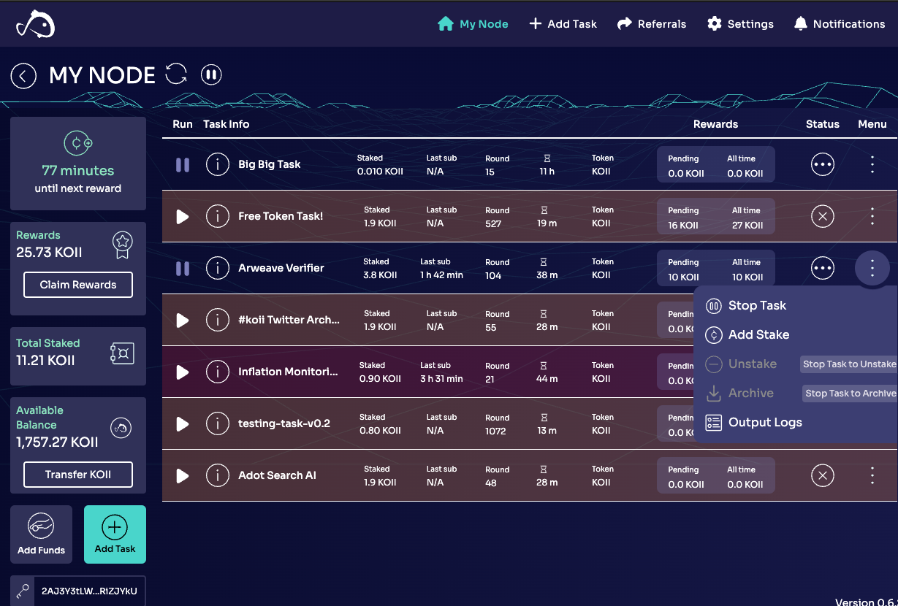

# Lesson 1: Your Node
This lesson covers how to get started hacking on your node.

## Part I. Getting Started
The big advantage of building with Koii is that our community of node operators are already prepared and eager to join your new project.

Node operators run their Node in the background on personal devices, so they can use excess capacity to run your app.

To build on Koii, we'll get started by getting to know your node.

### Install Your Node
Visit [the Koii website](https://koii.network) to download the client and install the node. Follow the prompts to get set up, and get some free tokens from the faucet while you're at it. ([1m tutorial video](https://www.youtube.com/watch?v=n2pvrSl01FI&t=1s))

### Test Your API In the Browser
Once your node is running, you can test your webserver in the browser by visiting [`http://localhost:30017/tasks`](http://localhost:30017/tasks). 

### Open The Node Application Folder
To see where the node keeps it's files, click any of the tasks in your Node and select 'View Logs' as shown below:


On Mac, the path to your logs will look something like this:
`/Users/almorris/Library/Application Support/KOII-Desktop-Node/namespace/6iRsCfmqdi7StUGCkbvZXwdxwmAd6txPwupAE76yF67F/task.log'`

Your parent directory for the node is up a couple of folders:
`/Users/almorris/Library/Application Support/KOII-Desktop-Node`

This parent folder contains a couple of key items, which we will mostly work with from a distance.
```
KOII-Desktop-Node % tree -d -L 2./
.
├── executables
├── logs
├── namespace
│   ├── 2H6BDyQrDZp7WgkPB8c29nAKRwgrZjU29ovLUipNUWLy
│   ├── 6GPu4gqQycYVJxw2oXK1QkkqXgtF9geft1L7ZHoDP4MQ
│   ├── 6iRsCfmqdi7StUGCkbvZXwdxwmAd6txPwupAE76yF67F
│   ├── CXjifqMWhR4QJT8MNY7BADJ5nstCbGLTgh7xreT9gmWp
│   ├── DZbRm6qRxy5ERPD61RHhVcS2sFootJ5fzSTWrzgoQmhf
│   ├── Gp2BcsuGgrvcEux3NER3fdtkjWQADY6S2h23c27HTAQ3
│   └── wJme8ZBopdCj54J556AxZeysBjDngnFbzDrKtJHg3E4
├── updater-cache
│   └── desktop-node-updater
└── wallets

14 directories
```

The key here is that each 'namespace' belongs to one Task, and all requisite logs, databases, and other information are stored here. Tasks cannot access anything outside of their own namespace, so master logs are kept at a node level as well (see `logs/main.log`)

In the next lesson we'll make use of this to start hacking on our node.

[Start Hacking in Part II: Task Flow](./PartII.md)