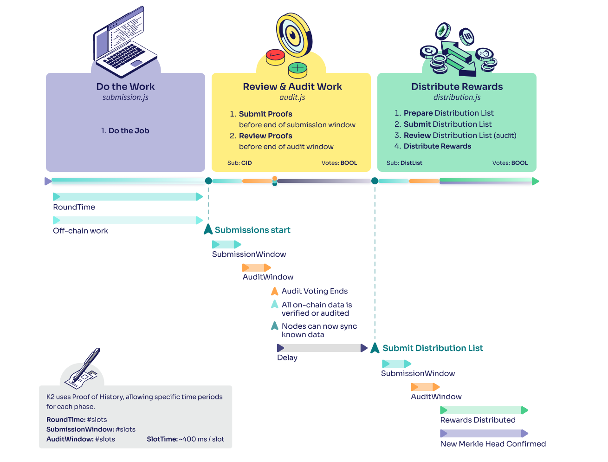

# Lesson 1: Introduction to Koii Tasks

> [!TIP]
>
> Want to skip the explanations and get started quickly?
>
> [Get a task up and running in 2 minutes](../Get%20Started%20-%20Quick%20Intro/README.md).

## Part 1: What is a Koii Task?

### Overview

A Koii Task is a decentralized computing job that runs across our network of nodes. Below is an infographic showing how a task runs (the runtime flow):

Let's take a look at a minimal example to see how the runtime flow works in practice.

### Example

To get you started, we've provided the code for a simple task in the [`EZ-testing-task/`](./EZ-testing-task/) folder. Let's go through it, looking at each step in the runtime flow shown above.

#### Do the work

1. **Do the job**: [`Submission.task()`](./EZ-testing-task/task/submission.js#L9). This task simply [saves the string "Hello, World!" to the local database](./EZ-testing-task/task/submission.js#L15)

#### Review and Audit Work

2. **Submit proofs**: [`Submission.fetchSubmission()`](./EZ-testing-task/task/submission.js#L51) and [`Submission.sendTask()`](./EZ-testing-task/task/submission.js#L31). Send the work to be checked. In this case, we are [fetching the string from the local database](./EZ-testing-task/task/submission.js#L54) and [submitting it](./EZ-testing-task/task/submission.js#L37).
3. **Review proofs**: [`Audit.validateNode()`](./EZ-testing-task/task/audit.js#L3). Other nodes in the network verify the work. Here we are [verifying whether the submission is the string "Hello, World!"](./EZ-testing-task/task/audit.js#L16).

#### Distribute Rewards

4. **Prepare Distribution List**: [`Distribution.generateDistributionList()`](./EZ-testing-task/task/distribution.js#L50). You may want to alter the logic for penalizing and rewarding nodes (see #4), but you usually won't need to change the code for preparing the distribution list.
5. **Submit Distribution List**: [`Distribution.submitDistributionList()`](./EZ-testing-task/task/distribution.js#L10). You won't normally need to change this.
6. **Review Distribution List**: [`Distribution.auditDistribution()`](./EZ-testing-task/task/distribution.js#L38).  You won't normally need to change this.
7. **Distribute Rewards**: Inside [`Distribution.generateDistributionList()`](./EZ-testing-task/task/distribution.js#L89). Rewards are distributed to each node that completed the work. Here we are penalizing incorrect submissions by [removing 70% of their stake](./EZ-testing-task/task/distribution.js#L123) and [equally distributing the bounty per round to all successful submissions](./EZ-testing-task/task/distribution.js#L140).

We'll revisit this task shortly, but first let's take a look at the Desktop Node. [Part II: Introduction to the Node](./PartII.md)
