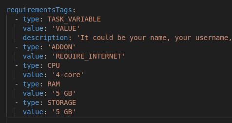

# Part II. Writing Networking Tasks

Now that you've got a basic understanding of how networking is done in the Node, it's time for deploy your own task that utilizes REST APIs!

Prerequisites:

- Understanding of UPnP
- Basic understanding of task template
- Knowledge on task deployment

## Initial Setup

Attached under this lesson is a skeleton template for a UPnP task that you can deploy. If you're not familiar how to deploy task, [try deploying a basic task](https://docs.koii.network/develop/command-line-tool/create-task-cli/create-task) first then come back here!

Much of the initial setup has been taken care of, but there is one thing to be aware of in the `config-task.yml`. You don't need to change anything here, and we will discuss this file further in [Lesson 3](../README.md) but if you are writing your own UPnP task, make sure that you have the `REQUIRE_INTERNET` addon specified, as shown below:



## Route Endpoints

### Your Node as a Server

Head to the `routes.js` file. There, you'll already see an example endpoint to retrieve task state.

The endpoints you define in `routes.js` will dictate what kinds of communications can occur between your device and another! Lets create a simple mechanism for passing basic data between two nodes. Below the example endpoint provided in `routes.js`, paste in this code snippet:

```
  app.get('/value', async (req, res) => {
    const value = process.env.VALUE;
    console.log('value', value);
    res.status(200).json({ value: value });
  });
```

The above code allows users to have some sort of data that other Nodes can access through making a request to this endpoint!

### Your Node as a Client

With our own endpoints set up, we now need to make calls to other Node's endpoints and access their value!

All the interesting logic for communicating with other Nodes can be found in the `submission.js` file. Lets dive in to some of the functions:

1. `getAddressArray()`

   - This function is being used to grab the list of endpoints for all the users running this particular task
   - This will be helpful later as we need to reference a particular Node's endpoint to grab their value!

2. `getRandomNodeEndpoint()`

   - This is a simple utility function that selects a random endpoint from the list of endpoints provided by all Nodes participating in the network task

3. `task()`
   - You learned in [Lesson 1](../Lesson%201/README.md) that this is where the core logic for the task and it's submission is. In this case, we are using this function to grab the value from a particular Node's endpoint
   - We simply use Axios to make a `get` request to the randomly selected other Node's endpoint, then store the result

As a result of this basic setup, every Node can provide server endpoints to be reached, and call other Node's endpoints to fetch data, resulting in Node to Node communication!

## Exercise

Create your own custom endpoint for a Node that sends a message to another Node. Remember to create a new route in `routes.js`, along with a new fetch request in the `task()` function from `submission.js`.

In the next section, we'll learn how to test networking tasks locally, with a Dockerized Node!

[Click here to start PartIII. Dockerized Node Testing](./PartIII.md)
