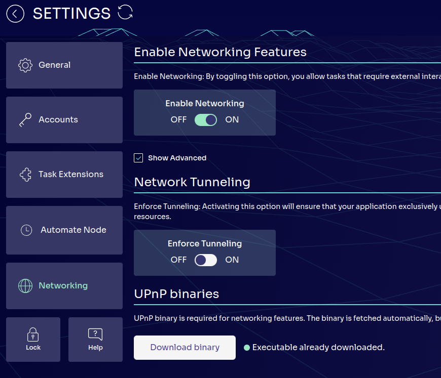

# Lesson 2: Writing a Networking & Storage Task

## Part I: Node to Node Communication

So far, we've seen how to navigate the node and run a simple task. In this lesson, we'll get an introduction to writing our own tasks by looking at node-to-node communication. First, we'll enable networking on our node.

### UPnP

Everything we've done until now has only really involved a single node, with a task that was independent of other nodes. This may not always be the case however; having a way to collaborate with other nodes can be extremely useful for writing tasks used for decentralized social applications, Web3 gaming, and many other tasks such as mathematical computations.

Koii uses Universal Plug and Play (UPnP) to accomplish this. UPnP is most commonly used by devices like gaming consoles and smart devices which makes connecting to these devices very straightforward, but that's not its only application. UPnP is a set of networking protocols that allows a network of devices to seamlessly connect to each other, making it perfect for allowing Koii nodes to communicate.

### Enabling UPnP in the Node

To enable UPnP on your Node, head to Settings -> Networking -> Enable Networking Features and simply toggle on the `Enable Networking` feature.

Additionally, check the advanced tab to download the required UPnP binaries if you don't have them.

### UPnP Security on Koii

As mentioned above, UPnP is awesome because it greatly reduces the complexity required for having interconnected devices. However, the tradeoff is that this allows direct access to your device, leading to possible security concerns.

At Koii, we recognize this issue, which is why UPnP is NOT required for you to use the Node and is disabled by default. You are free to enable or disable it as you see fit.

UPnP allows Koii tasks to utilize our vast network of over 60,000 Nodes to communicate effectively which is why it is such a powerful tool. Any tasks whitelisted by Koii are publicly available to inspect so you can be assured that UPnP is being used for productivity, not malice.

Additionally, if you would like to use UPnP with a more secure setup, you can manually use tunneling by toggling the `Enforce Tunneling` option as shown in the screenshot above. Tunneling allows your device to set up a proxy before connecting with other devices, which enhances security since your device won't be completely exposed to another, however it does require additional resources.

In the next lesson, we'll learn how we can write our own task that makes use of UPnP for networking.

[Click here to start PartII. Writing a Networking Task](./PartII.md)
