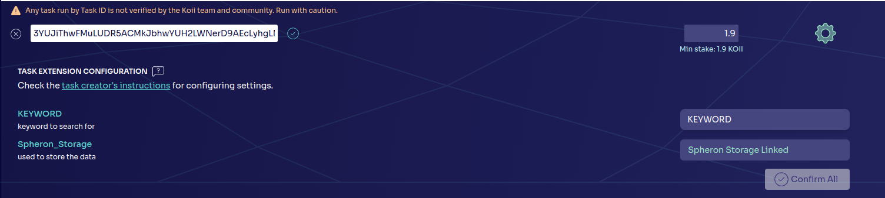

# Lesson 3: Secrets & Config

## Part III. Building a Crawler

Before we start writing our own crawler code, it's helpful to understand how to structure a web crawler task on Koii. We've [previously covered IPFS](../Lesson%202/PartIII.md), so this should be fairly straightforward. We've provided a skeleton for you to use in `simple-crawler/before` and `simple-crawler/after contains the complete crawler.

Prerequisites:

- General understanding of IPFS, see [Lesson 2, Part 3](../Lesson%202/PartIII.md) if you need a refresher
- Understanding of Puppeteer

### Environment variables

The task we're building here doesn't require any login info, but we'll be asking the user for a keyword they want to search for. add the following to the `config-task.yml` in the requirementsTags:

```yaml
- type: TASK_VARIABLE
  value: 'KEYWORD'
  description: 'keyword to search for'
```

**NOTE**: If you're testing locally, make sure to also add `KEYWORD` to your .env.

### Building the Crawler Object

In [`SimpleCrawlerTask.js`](./simple-crawler/before/crawler/SimpleCrawlerTask.js) you'll notice there's a bare bones function `crawl()`. We'll implement our web crawling logic here using puppeteer, explaining as we go!

1. **Open Desired Page** - We first need to set up a new user agent and navigate to the corresponding webpage that we are interesting in scraping. In this case, we're looking to scrape [redflagdeals](https://forums.redflagdeals.com/hot-deals-f9/`) as it provides a simple and static page with consistent styling of elements. This makes it a desirable target for web scraping. We can set the page with the following code:

```javascript
const page = await browser.newPage();
  await page.setUserAgent(
  "Mozilla/5.0 (Windows NT 10.0; Win64; x64) AppleWebKit/537.36 (KHTML, like Gecko) Chrome/87.0.4280.88 Safari/537.36"
);

const url = `https://forums.redflagdeals.com/hot-deals-f9/`;

// `documentloaded` means the loading icon on the left of the tab is resolved
await page.goto(url, { waitUntil: "domcontentloaded" });
```

<br>

2. **Search w/ Specific Elements** - Every page you crawl will need this code customized, because it's search for CSS selectors specific to page. (This also means your crawler can break if the page design is updated, so watch out for that!) In our case, we can access the search bar using the selector `#search_keywords`. Then, we can utilize the keyword that was provided as a task extension (secret) to filter our searches. Here's the code:

```javascript
// Wait for the search bar to load
await page.waitForSelector("#search_keywords");

// type the search term into the search bar
await page.type("#search_keywords", this.searchTerm);

// submit the search term
await page.keyboard.press("Enter");
```

<br>

3. **Grab Post Titles** - Now that we have filtered our search results, we move on to the scraping aspect. For this simple example, we'll just grab every post header's text content. Once again, the specific code you need to write will depend on the webpage you're scraping and the data you want to retrieve.

**NOTE**: When the scraping is complete, be sure to call browser.close() as a new browser is launched every time the task is run.

```javascript
// Wait for the links to load after the search term is submitted
await page.waitForSelector("h2.post_subject");

// Get the titles of the links
let titles = null;
try {
  titles = await page.$$eval("h2.post_subject a", (links) =>
    links.map((link) => link.textContent.trim())
  );
} catch (error) {
  console.log("Error:", error);
}

// close puppeteer
await browser.close();

return titles;
```

### Using the Crawler Object

Now that we've defined the crawler object, we can make use of it in our `submission.js` file. Find the `task()` function and write the following code:

```javascript
// create a new crawler task with the keyword defined by you or the node user
const newTask = new SimpleCrawlerTask(process.env.KEYWORD);
// perform the crawl and get the scraped data
const newTitles = await newTask.crawl();
// store the scraped data in a file on IPFS using the Koii Storage SDK
const cid = await this.storeFile(newTitles);
// save the CID from IPFS in the local DB
await namespaceWrapper.storeSet("cid", cid);
```

As you can see, we're simply instantiating the object with the corresponding `KEYWORD` secret that has been provided (either by you locally in your .env, or by a user on the node). Once the object is created, we start the crawl, fetch the titles, then store them in a file on IPFS.

### Auditing

Finally, during auditing, we'll retrieve the uploaded file and verify it. In this case, we'll just check to make sure the file exists, but you can perform more extensive checks as needed.

In `SimpleCrawlertask.js`, find the function `retrieveAndValidateFile()` and add the following code:

```javascript
// instantiate the storage client
const client = new KoiiStorageClient();

try {
  // get the uploaded file using the IPFS CID we stored earlier and the filename (in this case, `dealsData.json`)
  const upload = await client.getFile(cid, filename);
  // return whether or not the file exists
  return !!upload;
} catch (error) {
  console.error('Failed to download or validate file from IPFS:', error);
  throw error;
}
```

In `audit.js` find `validateNode()` and add the following code:

```javascript
  try {
    return SimpleCrawlerTask.retrieveAndValidateFile(submission_value);
  } catch (e) {
    console.log('Error in validate:', e);
    return false;
  }
```

### Deployment

Now that you've built out the web crawler, feel free to deploy it onto the node! Once it's been deployed, navigate to `+Add Task`, then add an advanced task. Paste in your taskID you saved, and you should see your web crawler task load with all the secrets you specified as shown below:



Just like that, you've successfully created your very own web crawler! This template is very customizable and relatively simple. As you encounter more dynamic webpages, you may find it more difficult to web crawl. If you're concerned about websites with logging in, cookies, or dynamic content, we recommend checking out our [Twitter Archiver!](https://github.com/koii-network/task-X)

<br>
<br>

You've reached the end of this lesson which means you're now able to create your very own web crawler for any simple webpage! The next lesson will discuss data sharing and replication incentives.

[Click here to start Lesson 4](../Lesson%204//README.md)
