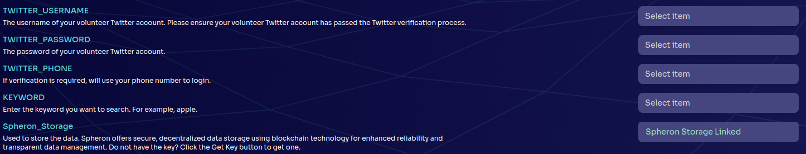
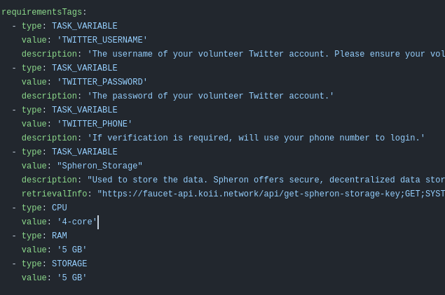
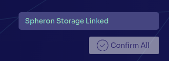

# Lesson 3: Secrets & Crawlers

This lesson covers how to use secrets to build out full web crawlers. Here is the lesson plan:

- [Part I. Secrets](./README.md) - Explains and showcases with an example how secrets are used and implemented for tasks
- [Part II. Crawler Task Structure](./PartII.md) - Discusses a conceptual overview on what the crawler task structure entails and what the plan is
- [Part III. Building a Crawler](./PartIII.md) - Walks through exactly how to build out a simple and customizable template for a web crawler

Prerequisites:

- Familiarity with creation and deployment of tasks

DISCLAIMER: _This should only be used for legal purposes such as publicly archiving data. Koii does not condone using tasks to steal data or infringe on personal privacy_

## Part I. Secrets

One of the best use cases for Koii tasks is web crawling. While there are many webpages that allow users to endlessly scroll without having an account, most webpages only give a small snippet of content without logging in. This means having an autonomous web crawler without having a means to login would be effectively useless.

This is where secrets become very handy!

### Secrets in Your Node

If you have explored the Node enough, you may have noticed that some tasks require **Task Extensions** before you're able to run them. When you hear task extensions, it is essentially the same as secrets, so the two terms are used interchangeably. Task extensions may look something like this:

These Task Extensions/Secrets can be used by the task developer to bypass the issues that we described above. With the help of secrets, your crawler task can easily utilize an account to login, get full access to a webpage's content, and start archiving information!

### Secrets in Task Development

In [Lesson 2](../Lesson%202/README.md), we added something to our `task-config.yml` requirements section to make UPnP configuration work. Now, we can see that a task developer can also use the requirements section to specify any number of secrets they may need for a task to function! The image below showcases `Archive Twitter's` requirements section:

As you can see, each task extension has a corresponding value and description, which will be used by the Node. On the development side, the task extensions will be automatically linked as environment variables and can be used as such e.g/ `process.env.TWITTER_USERNAME`

One final thing to note is that during development, you must specify your own copies of each variable in the `.env` file. In this example, it means your `.env` will contain TWITTER_USERNAME, TWITTER_PASSWORD, TWITTER_PHONE, etc.

Think about the requirements tag as a way for users to easily create their own `.env` file, then run the task code.

If you're interested in looking at the `Twitter Archive` task more in depth, [click here!](https://github.com/koii-network/task-X)

### Spheron Storage Secret

You may have noticed with this task, and many others, the presence of a `Spheron_Storage` task extension. In fact, it's so prevalent that this specific task extension auto links!

Spheron storage is a service that allows us to use IPFS for storage. Put simply, IPFS is a protocol that allows for decentralized storing and sharing of data in a distributed file system. Spheron is simply an dApp that allows us to easily make use of IPFS, which is why a Spheron key is required for many tasks. Learn more about IPFS [here!](https://docs.koii.network/develop/write-a-koii-task/task-development-kit-tdk/using-the-task-namespace/storage-via-ipfs)

 

With a basic understanding of secrets and their usages in both the Node and during task development, we can start looking at how to create our very own crawler!

[Click here to start PartII. Crawler Task Structure](./PartII.md)
