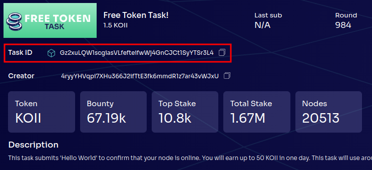

# Lesson 7: Deployment and Updates

## Part I: Testnet and Desktop Node

### Deploying to Testnet

> [!WARNING]
>
> In order to deploy or update a task, you **MUST** be using at least Node.js v18.

Deploying a Koii task is covered in [Lesson 1](../Lesson%201/PartIV.md#deploying-a-task) and deploying a KPL task is covered in [Lesson 6](../Lesson%206/PartII.md).

### Updating a Task

Updating a task is very similar to deployment, and just requires a couple of changes to your `config-task.yml`. At the bottom of the file, you'll see this section:

```yml
# OPTIONAL variables variables for creating task / REQUIRED variables for update task

# ONLY provide the task_id and migrationDescription if you are updating the task otherwise leave blank
# task_id: Previous task id
task_id: ''

# migrationDescription: Provide the description for changes made in new version of task
migrationDescription: ''
```

Both of these must be filled in when updating. The `task_id` should be the last task ID you used when updating or deploying your task. If you are running your task in the desktop node you can find it here:



Now, when running

```sh
npx @_koii/create-task-cli@latest
```

Choose `Update Existing Task` and follow the prompts, which you should already be familiar with from deploying a task. If you're unsure of any steps, refer to the [Lesson 1 deployment instructions](../Lesson%201/PartIV.md#deploying-a-task).
