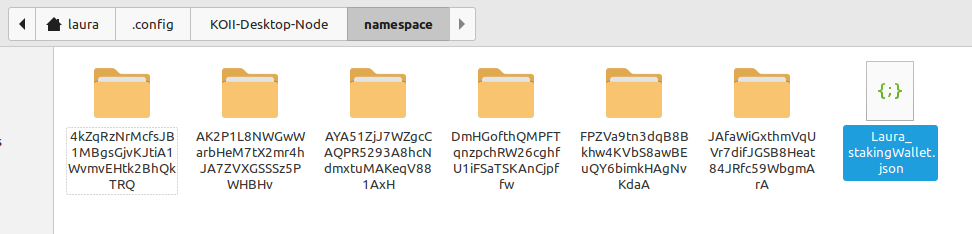

# Lesson 7: Deploying your Task

Now that we've seen how to make several tasks, test them locally, and deploy with Docker, it's time to talk about deploying to the Community Cloud.

## Funding Your Task

When you deploy a task to the community, you'll have to pay rent and a bounty. To help developers get started, Koii has a [grant program](https://www.koii.network/founders) that can help you out with initial funding.

## Building

The first step before deployment is to build your executable. First, makes sure you have installed all the necessary dependencies using

```sh
npm install
```

Then run

```sh
npm run webpack
```

in order to create the executable.

## Deploying

Now it's time to deploy our executable. For this you'll need to run `npx @_koii/create-task-cli@latest`, which will show you the following menu:

```sh
? Select operation › - Use arrow-keys. Return to submit.
❯   Create a New Local Repository
    Deploy a New Task
    Update Existing Task
    Activate/Deactivate Task
    Claim Reward
    Fund Task with More KOII
    Withdraw Staked Funds from Task
    Upload Assets to IPFS (Metadata/Local Vars)
```

Choose "Deploy a New Task", which will show you the following menu:

```sh
? Select operation › - Use arrow-keys. Return to submit.
❯   using CLI
    using config YML
```

Choose "Using config YML" and you will be asked to enter the path to your staking wallet. When you installed the desktop node, a staking wallet was created for you automatically. This is separate from your main wallet, and can be found in `<OS-specific path>/KOII-Desktop-Node/namespace/`.

The OS-specific paths are as follows:

**Windows**: `/Users/<username>/AppData/Roaming`

**Mac**: `/Users/<username>/Library/Application Support`

**Linux**: `/home/<username>/.config` (This path contains a dot folder that will be hidden by default. You can show hidden folders by pressing Ctrl-H)

Here you should see a file with the name `<name>stakingWallet.json`. Enter the full path to this file (`<OS-specific path>/KOII-Desktop-Node/namespace/<name>stakingWallet.json`).

In the example below, this would be `home/laura/.config/KOII-Desktop-Node/namespace/Laura_stakingWallet.json`



You will be then be prompted to confirm that you want to pay the rent and bounty, type 'y' to confirm:

```sh
Your account will be deducted XX KOII for creating the task, which includes the rent exemption(XX KOII) and bounty amount fees (XX KOII) › (y/N)
```

Your task should now be deployed successfully and you should see a response similar to this:

```sh
Calling Create Task
Task Id: 9oDEkeHwyGJVect8iEF1hHPKYdkqbtRToarbi8KQtgNS
Stake Pot Account Pubkey: stakepotaccountp39zkKbCKoiLp3wZ66TuUu5LtS9d
Note: Task Id is basically the public key of taskStateInfoKeypair.json
Success
```

Congratulations! You've deployed a task to K2.

## Whitelisting

We take the security of our users seriously, so by default, your task will not be visible to node users unless they add it manually using the Advanced option under Add Task. To have your task added to the Add Task list, you will need to apply to have it [whitelisted](https://docs.koii.network/develop/write-a-koii-task/task-development-guide/task-development-flow/whitelist-task).

Now that you've successfully deployed a task, it's time to learn about performance improvements and iterating on your task: [Lesson 8](../Lesson%208/README.md)
